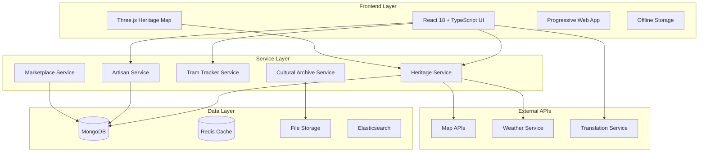

# Design Document

## Overview

Heritage Connect Bengal transforms the existing Rural Connect AI platform into a comprehensive heritage preservation and community connection system for Bengal. The design maintains the robust React 18 + TypeScript + Vite architecture while pivoting all domain logic, UI components, and data models to focus on Bengali cultural heritage, traditional crafts, and urban-rural cultural bridges.

The system leverages the existing offline-first architecture, Three.js integration, and mobile-responsive design to create an authentic platform that connects Kolkata's urban heritage enthusiasts with rural Bengal's living artisan traditions.

## Architecture

### High-Level System Architecture



### Component Architecture Transformation

The design reuses existing component structures while transforming their domain focus:

- `AgriculturalDashboard` → `ArtisanCraftDashboard`
- `CommunityMatching` → `HeritageBridge`
- `BusinessDirectory` → `HeritageMarketplace`
- `CulturalStorytellingDashboard` → `SmritiArchive`
- `InteractiveMap` → `HeritageMap` (enhanced with Three.js)

## Components and Interfaces

### Core Heritage Components

#### HeritageMap Component
```typescript
interface HeritageMapProps {
  region: 'kolkata' | 'rural-bengal' | 'full-bengal';
  showTramRoutes: boolean;
  showArtisanClusters: boolean;
  showHeritageSites: boolean;
  interactive3D: boolean;
}

interface HeritageLocation {
  id: string;
  name: string;
  type: 'heritage-site' | 'artisan-cluster' | 'tram-stop' | 'cultural-landmark';
  coordinates: [number, number];
  description: string;
  culturalSignificance: string;
  visitingInfo?: VisitingInfo;
  artisanCount?: number;
}
```

#### ArtisanProfile Component
```typescript
interface ArtisanProfile {
  id: string;
  name: string;
  craftSpecialty: CraftCategory;
  yearsOfExperience: number;
  location: HeritageLocation;
  verificationStatus: 'verified' | 'pending' | 'community-endorsed';
  guruLineage?: string;
  availableForTeaching: boolean;
  marketplaceActive: boolean;
  culturalStory?: string;
  gallery: MediaItem[];
}

type CraftCategory = 
  | 'dokra' 
  | 'kantha' 
  | 'patachitra' 
  | 'terracotta' 
  | 'handloom' 
  | 'shola' 
  | 'baluchari'
  | 'folk-music'
  | 'traditional-cooking';
```

#### TramTracker Component
```typescript
interface TramRoute {
  routeNumber: string;
  name: string;
  historicalSignificance: string;
  establishedYear: number;
  currentStatus: 'active' | 'heritage-only' | 'discontinued';
  stops: TramStop[];
  heritagePoints: HeritagePoint[];
}

interface TramStop {
  id: string;
  name: string;
  coordinates: [number, number];
  nearbyHeritage: HeritageLocation[];
  walkingTours: WalkingTour[];
}
```

### Cultural Archive System

#### SmritiArchive Component
```typescript
interface CulturalMemory {
  id: string;
  title: string;
  type: 'folk-song' | 'patachitra' | 'temple-architecture' | 'durga-puja' | 'oral-history';
  content: MediaContent;
  language: 'bengali' | 'english' | 'bilingual';
  region: string;
  contributor: ContributorInfo;
  verificationStatus: 'verified' | 'community-reviewed' | 'pending';
  culturalContext: string;
  preservationPriority: 'high' | 'medium' | 'low';
}

interface MediaContent {
  text?: string;
  audio?: AudioFile;
  images?: ImageFile[];
  video?: VideoFile;
  metadata: ContentMetadata;
}
```

### Marketplace Integration

#### HeritageMarketplace Component
```typescript
interface CraftProduct {
  id: string;
  artisanId: string;
  name: string;
  category: CraftCategory;
  description: string;
  culturalStory: string;
  price: number;
  currency: 'INR';
  authenticity: AuthenticityVerification;
  shippingInfo: ShippingDetails;
  customizationOptions?: CustomizationOption[];
}

interface AuthenticityVerification {
  verified: boolean;
  verifiedBy: 'artisan-guild' | 'heritage-expert' | 'community';
  certificateUrl?: string;
  traditionalTechnique: boolean;
}
```

## Data Models

### User Model Extensions
```typescript
interface HeritageUser extends BaseUser {
  preferredLanguage: 'bengali' | 'english';
  heritageInterests: CraftCategory[];
  locationPreferences: {
    kolkata: boolean;
    ruralBengal: boolean;
    specificDistricts: string[];
  };
  userType: 'heritage-seeker' | 'artisan' | 'guru' | 'cultural-contributor';
  culturalBackground?: CulturalBackground;
}

interface CulturalBackground {
  familyTraditions: string[];
  spokenDialects: string[];
  culturalKnowledge: KnowledgeArea[];
}
```

### Heritage Location Model
```typescript
interface HeritageLocationModel {
  _id: ObjectId;
  name: string;
  type: LocationType;
  coordinates: GeoJSON.Point;
  address: AddressDetails;
  culturalSignificance: CulturalSignificance;
  accessibility: AccessibilityInfo;
  visitingHours?: OperatingHours;
  seasonalAvailability?: SeasonalInfo;
  associatedArtisans: ObjectId[];
  heritageStatus: 'unesco' | 'asi' | 'state-protected' | 'community-recognized';
}

interface CulturalSignificance {
  historicalPeriod: string;
  culturalImportance: string;
  traditionalUse: string;
  currentStatus: string;
  preservationEfforts: string[];
}
```

### Tram System Model
```typescript
interface TramSystemModel {
  _id: ObjectId;
  routes: TramRoute[];
  historicalTimeline: HistoricalEvent[];
  currentOperations: OperationalStatus;
  heritageValue: HeritageAssessment;
  futurePlans: DevelopmentPlan[];
}

interface HistoricalEvent {
  year: number;
  event: string;
  significance: string;
  sourceDocuments?: string[];
}
```

## Correctness Properties

*A property is a characteristic or behavior that should hold true across all valid executions of a system—essentially, a formal statement about what the system should do. Properties serve as the bridge between human-readable specifications and machine-verifiable correctness guarantees.*

### Property Reflection

After analyzing all acceptance criteria, several properties can be consolidated to avoid redundancy:

- Branding consistency properties (1.1, 1.5) can be combined into a comprehensive branding verification property
- Content display properties (2.2, 6.5, 8.2) share similar patterns and can use unified content verification approaches
- Search and filtering properties (2.1, 5.3, 6.4) follow similar patterns for different content types
- Offline functionality properties (11.1-11.5) can be consolidated into comprehensive offline capability verification

### Core Properties

**Property 1: Complete Branding Transformation**
*For any* rendered UI component, it should display "Heritage Connect Bengal" branding and contain no references to "Rural Connect AI" or Australian contexts
**Validates: Requirements 1.1, 1.5**

**Property 2: Bengali Cultural Aesthetics**
*For any* UI theme configuration, the color scheme should use terracotta, deep green, and saffron colors consistent with Bengali cultural aesthetics
**Validates: Requirements 1.2**

**Property 3: Language Toggle Preservation**
*For any* user session, toggling between Bengali and English should preserve user context and maintain all functionality
**Validates: Requirements 1.3, 10.2**

**Property 4: Artisan Search Matching**
*For any* heritage seeker search query, returned artisan matches should be relevant to the specified craft specialty, location, and availability criteria
**Validates: Requirements 2.1**

**Property 5: Complete Profile Information Display**
*For any* artisan profile display, it should contain craft category, years of experience, Bengal location, and verification status
**Validates: Requirements 2.2**

**Property 6: Connection Workflow Integrity**
*For any* successful connection between heritage seeker and artisan, the platform should enable direct communication and track the connection outcome
**Validates: Requirements 2.3, 2.4, 2.5**

**Property 7: Personalized Market Intelligence**
*For any* artisan accessing the platform, they should receive market demand data, pricing guidance, and recommendations specific to their craft category
**Validates: Requirements 3.1, 3.2, 3.3, 3.4, 3.5**

**Property 8: Interactive Heritage Map Functionality**
*For any* user interaction with the Three.js heritage map, it should display relevant heritage sites, artisan clusters, tram routes, and cultural landmarks with detailed information
**Validates: Requirements 4.1, 4.2, 4.3, 4.4**

**Property 9: Offline Map Capability**
*For any* heritage map data, essential information should be cached for offline access and synchronized when connectivity is restored
**Validates: Requirements 4.5, 11.1, 11.2**

**Property 10: Marketplace Product Categorization**
*For any* craft product listing, it should be properly categorized into traditional Bengali craft types (Dokra, Kantha, Patachitra, Terracotta, Handloom, Shola, Baluchari) with complete authenticity verification
**Validates: Requirements 5.1, 5.2**

**Property 11: Comprehensive Search Filtering**
*For any* marketplace search query, filtering should work correctly across craft type, price range, artisan location, and authenticity level
**Validates: Requirements 5.3**

**Property 12: Secure Fair Trade Transactions**
*For any* marketplace transaction, it should provide secure processing, fair trade pricing transparency, and appropriate shipping coordination for fragile crafts
**Validates: Requirements 5.4, 5.5**

**Property 13: Cultural Content Acceptance and Verification**
*For any* cultural content submission (folk songs, Patachitra art, temple architecture, Durga Puja traditions), it should be accepted in Bengali or English with proper metadata and community verification
**Validates: Requirements 6.1, 6.2, 6.3**

**Property 14: Cultural Archive Search and Attribution**
*For any* archived cultural content, it should be searchable by region, tradition type, and time period, with proper attribution to contributors and tradition keepers
**Validates: Requirements 6.4, 6.5**

**Property 15: Guru-Shishya Matching and Tracking**
*For any* guru-shishya pairing, matching should be based on skill interest, location proximity, and learning commitment, with progress tracking and lineage record maintenance
**Validates: Requirements 7.1, 7.2, 7.3, 7.4, 7.5**

**Property 16: Comprehensive Tram Heritage Information**
*For any* tram route selection, it should display real-time locations, schedules, historical information, cultural significance, and integrated heritage site navigation
**Validates: Requirements 8.1, 8.2, 8.3, 8.4, 8.5**

**Property 17: Community Safety and Wellbeing Alerts**
*For any* heritage site or community event, appropriate safety alerts, weather warnings, and wellness resources should be provided based on current conditions and user needs
**Validates: Requirements 9.1, 9.2, 9.3, 9.4, 9.5**

**Property 18: Bengali Language and Cultural Localization**
*For any* Bengali language content, it should use appropriate fonts (Noto Sans Bengali or Hind Siliguri), support text input, preserve dialect variations, and display culturally appropriate date formats
**Validates: Requirements 10.1, 10.3, 10.4, 10.5**

**Property 19: Comprehensive Offline Functionality**
*For any* core platform feature (artisan profiles, messaging, heritage sites, safety information), it should maintain functionality offline with appropriate caching, compression, and synchronization
**Validates: Requirements 11.1, 11.2, 11.3, 11.4, 11.5**

**Property 20: Cultural Calendar Integration**
*For any* Bengali cultural event (Durga Puja, Poila Boishakh, heritage walks), it should be displayed in the calendar with personalized notifications, organization coordination, registration support, and lunar-Gregorian date integration
**Validates: Requirements 12.1, 12.2, 12.3, 12.4, 12.5**

## Error Handling

### Heritage Data Validation
- **Artisan Profile Validation**: Verify craft categories against approved Bengali traditional crafts list
- **Cultural Content Validation**: Ensure submitted cultural content meets authenticity and cultural sensitivity standards
- **Location Validation**: Validate heritage site coordinates and cultural significance claims
- **Language Validation**: Ensure Bengali text input uses proper Unicode encoding and font rendering

### Offline Error Handling
- **Sync Conflict Resolution**: Handle conflicts when offline changes conflict with server updates
- **Cache Corruption Recovery**: Implement recovery mechanisms for corrupted offline data
- **Partial Sync Handling**: Manage scenarios where only partial data synchronization is possible
- **Network Transition Errors**: Handle errors during online/offline state transitions

### Cultural Sensitivity Error Prevention
- **Content Moderation**: Implement community-driven moderation for cultural accuracy
- **Attribution Verification**: Ensure proper credit and permissions for traditional knowledge
- **Dialect Preservation**: Prevent loss of regional Bengali dialect variations during processing
- **Festival Date Accuracy**: Validate lunar calendar calculations for traditional festivals

## Testing Strategy

### Dual Testing Approach

The Heritage Connect Bengal platform requires both unit testing and property-based testing to ensure comprehensive coverage of cultural authenticity, technical functionality, and user experience.

**Unit Tests** focus on:
- Specific Bengali cultural content validation examples
- Heritage site data accuracy verification
- Tram route historical information correctness
- Cultural calendar date calculations
- Bengali language rendering and font display
- Artisan profile component rendering with sample data

**Property-Based Tests** focus on:
- Universal properties across all heritage content types
- Search and filtering behavior across different craft categories
- Language toggle functionality preservation across all UI states
- Offline synchronization behavior across various network conditions
- Cultural content attribution consistency across all submission types

### Property-Based Testing Configuration

**Testing Framework**: Use `fast-check` for TypeScript property-based testing
**Test Iterations**: Minimum 100 iterations per property test
**Test Tagging**: Each property test must reference its design document property using the format:
`// Feature: heritage-connect-bengal, Property {number}: {property_text}`

### Cultural Authenticity Testing

**Heritage Content Validation**:
- Test traditional craft categorization accuracy
- Verify cultural significance descriptions
- Validate Bengali language content preservation
- Test festival date calculations against lunar calendar

**Community Integration Testing**:
- Test artisan-heritage seeker matching algorithms
- Verify guru-shishya connection workflows
- Test cultural content community moderation processes
- Validate tram heritage information accuracy

### Performance and Accessibility Testing

**Three.js Heritage Map Performance**:
- Test 3D map rendering performance on mobile devices
- Verify offline map functionality under various network conditions
- Test map interaction responsiveness with large datasets

**Bengali Language Accessibility**:
- Test screen reader compatibility with Bengali text
- Verify font rendering across different devices and browsers
- Test keyboard navigation with Bengali input methods
- Validate color contrast for cultural color schemes

### Integration Testing Priorities

1. **Heritage Map Integration**: Test Three.js map with real Bengal geographical data
2. **Tram System Integration**: Verify real-time tram data integration and historical accuracy
3. **Cultural Calendar Integration**: Test lunar calendar calculations with Bengali festivals
4. **Marketplace Integration**: Test end-to-end craft purchasing workflows
5. **Offline Sync Integration**: Test comprehensive offline-to-online data synchronization
```

Now I'll use the prework tool to analyze the acceptance criteria before writing correctness properties:

<function_calls>
<invoke name="prework">
<parameter name="featureName">heritage-connect-bengal